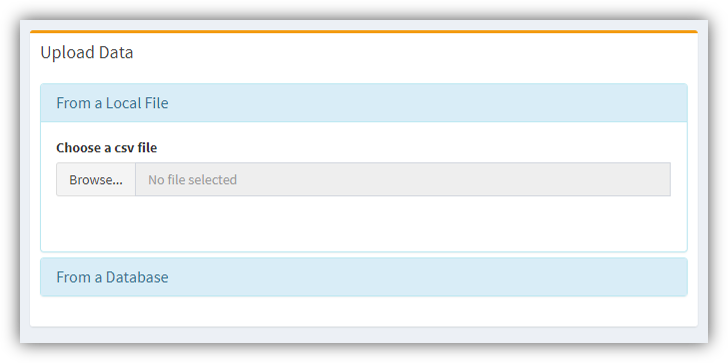
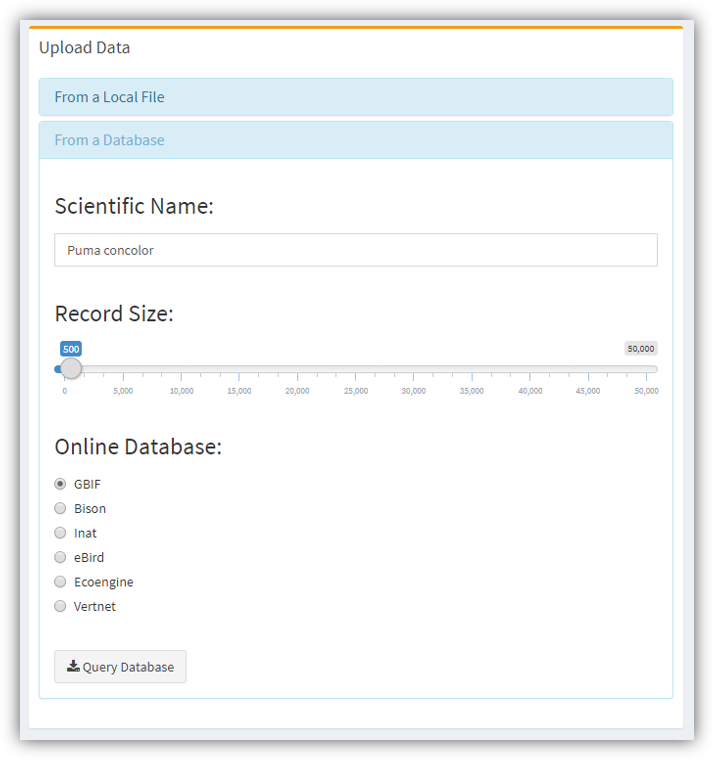
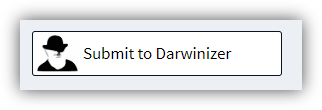

# The shiny app

***

## Launching the app

```r
library(bdDwC) # Laod package library
runDwC() # Launch the app
```

## App overview

[comment]: <> (Need-To-Be-Updated!)


 In the first screen, you'll need to load your biodiversity data; choose dictionary and run the Darwinizer. There are two options, form a file on your computer, of fetch from a web based data provider.

## Data upload

### From a local file

A CSV file or a Darwin Core Archive (DwC-A) zip file can be uploaded.


[comment]: <> (Need-To-Be-Updated!)


 

### From an online database

Also, data can be retrieved directly from various online biodiversity databases. You need only to:

* Select the database
* Specify the desired scientific name.
* Specify the number of records (upper limit of 50,000).
* Check the box if records must have coordinates.
* Wait for data to be downloaded.

[comment]: <> (Need-To-Be-Updated!)




## Dictionaries

A dictionary is a key component when Darwinizing a dataset. It's basically a lookup table that lists a possible variation of field name and it corresponding DwC name.


### The Darwin Cloud dictionary

The Darwin Cloud dictionary [@DarwinCloud], is a lookup table that accumulates different variations in DwC field names from different publishers. This valuable and critical dictionary was created and is maintained by the Kurator project (http://kurator.acis.ufl.edu/kurator-web/), which provides workflow tools for data quality improvement of biodiversity data, via a user-friendly web interface. The development of bdDwC was inspired by <a href= https://github.com/kurator-org/kurator-validation/wiki/CSV-File-Darwinizer target="_blank">Kurator's own Darwinizer</a>.

#### Updating the Darwin Cloud dictionary{-}

It's recommended to update the Darwin Cloud dictionary file. This can be done easily by clicking the **Update DC** button.

[comment]: <> (Need-To-Be-Updated!)


### Custom dictionary

It's also possible to add your own dictionary by creating a CSV file with two columns, one for the Field Names and one for the Standard Names. After uploading the custom disctionary, we need to specify which field denotes the 'User fierld names' and which is the 'Standard (DwC) field names'. 

[comment]: <> (Need-To-Be-Updated!)


## Darwinizing your dataset

Once a dataset is uploaded, the 'Submit to Darwinizer' button is activated, Clicking it will begin the interactive 'Darwinize the dataset' process.

[comment]: <> (Need-To-Be-Updated!)



## Darwinizer results

### Results page overwiew

[comment]: <> (Need-To-Be-Updated!)


Manually renaming field names can be done very easily, just choose the two corresponding fields and click the Rename button. 

[comment]: <> (Need-To-Be-Updated!)


Hovering over a DwC standard name will display its description.


## Download your Darwinized data

[comment]: <> (Need-To-Be-Updated!)

## Closing the app
Just close the app browser tab, and the R session will be terminated. To reopen it run in the R Console `runDwC()`.

## References

