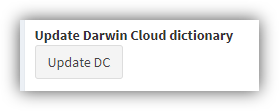
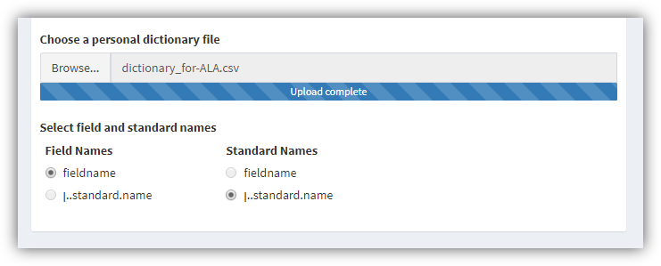

# The shiny app

***

## Launching the app

```r
library(bdDwC) # Uplaod package library
runDwC() # Launch the app
```

## App overview

**<span style="color:red">[ Need To Be Updated! ]</span>**


 In the first screen, you'll need to upload or download your biodiversity data; choose dictionary and run the Darwinizer.

## Data upload

### From a local file

A CSV file or a Darwin Core Archive (DwC-A) zip file can be uploaded.

**Local file size cannot exceed <span style="color:red">1GB [?]</span>**


**<span style="color:red">[ Need To Be Updated! ]</span>**


 

### From an online database

Also, data can be retrieved directly from various online biodiversity databases. You need only to:

* Select the database
* Specify the desired scientific name.
* Specify the number of records (upper limit of 50,000).
* Check the box if records must have coordinates.
* Wait for data to be downloaded.

**<span style="color:red">[ Need To Be Updated! ]</span>**


## Dictionaries

A dictionary is a key component when Darwinizing a dataset. It's basically a lookup table that lists a possible variation of field name and it corresponding DwC name.


### The Darwin Cloud dictionary

The Darwin Cloud dictionary [@DarwinCloud], is a lookup table that accumulates different variations in DwC field names from different publishers. This valuable and critical dictionary was created and is maintained by the Kurator project (http://kurator.acis.ufl.edu/kurator-web/), which provides workflow tools for data quality improvement of biodiversity data, via a user-friendly web interface. The development of bdDwC was inspired by [Kurator's own Darwinizer](https://github.com/kurator-org/kurator-validation/wiki/CSV-File-Darwinizer target="_blank").

#### Updating the Darwin Cloud {-}

It's recommended to update the Darwin Cloud file. This can be done easily by clicking the **Update DC** button.

**<span style="color:red">[ Need To Be Updated! ]</span>**



### Your own dictionary

It's also possible to add your own dictionary by simply creating a CSV file with two columns, one for the Field Names and one for the Standard Names.

**<span style="color:red">[ Need To Be Updated! ]</span>**



## Darwinizing your dataset

Once a dataset is uploaded, the 'Submit to Darwinizer' button is activated, Clicking it will Darwinize the dataset.

**<span style="color:red">[ Need To Be Updated! ]</span>**


## Darwinizer results

### Results page overwiew

**<span style="color:red">[ Need To Be Updated! ]</span>**


Manually renaming field names can be done very easily, just choose the two corresponding fields and click the Rename button. 

**<span style="color:red">[ Need To Be Updated! ]</span>**


Hovering over a DwC standard name will display its description.


## Download your Darwinized data

**<span style="color:red">[ Need To Be Updated! ]</span>**

## Closing the app
Just close the app browser tab, and the R session will be terminated. To reopen it run in the R Console `runDwC()`.

## References

